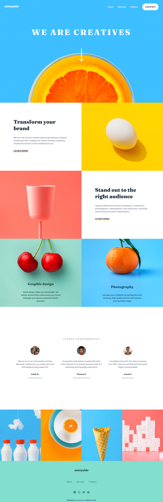
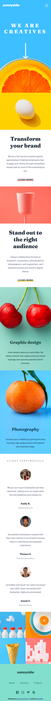

# Frontend Mentor - Sunnyside agency landing page solution

This is a solution to the [Sunnyside agency landing page challenge on Frontend Mentor](https://www.frontendmentor.io/challenges/sunnyside-agency-landing-page-7yVs3B6ef). Frontend Mentor challenges help you improve your coding skills by building realistic projects.

## Table of contents

- [Overview](#overview)
  - [The challenge](#the-challenge)
  - [Screenshot](#screenshot)
  - [Links](#links)
- [My process](#my-process)
  - [Built with](#built-with)
  - [Useful resources](#useful-resources)
- [Author](#author)

## Overview

### The challenge

Users should be able to:

:white_check_mark: View the optimal layout for the site depending on their device's screen size

:white_check_mark: See hover states for all interactive elements on the page

### Screenshot

#### Desktop

#### Mobile

### Links

- Solution URL: [here](https://your-solution-url.com)
- Live Site URL: [here](https://your-live-site-url.com)

## My process

### Built with

- Semantic HTML5 markup
- CSS custom properties
- Flexbox
- CSS Grid
- Media Queries
- GSAP Animation
- JS

### Useful resources

- [GSAP installation](https://greensock.com/docs/v3/Installation)
- [GSAP Timeline](https://greensock.com/docs/v3/GSAP/Timeline)
- [GSAP ScrollTrigger](https://greensock.com/docs/v3/Plugins/ScrollTrigger)

## Author

- Frontend Mentor - [@MBenmasour95](https://www.frontendmentor.io/profile/MBenmasour95)
